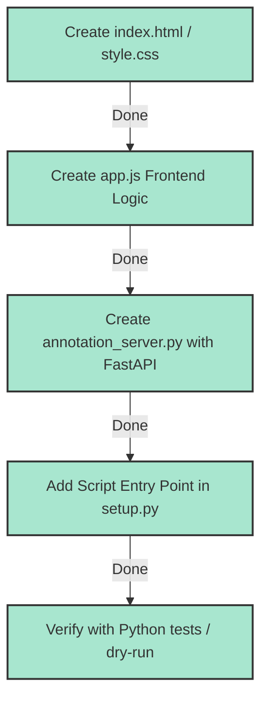

# LeRobot ROS2 Bag Annotation GUI - Implementation Plan

This document outlines the goal, components, and implementation plan for building the interactive web-based GUI for annotating ROS2 bags and converting them to LeRobot datasets.

## 1. Goal
Provide an interactive, web-based graphical user interface (GUI) to:
- **Scan & Load ROS2 Bags**: Browse bags inside the workspace.
- **Scrub & Playback**: View cameras and telemetry state synchronized chronologically.
- **Annotate Episodes**: Graphically define time ranges (`start_time` and `end_time`) and tag them with task names (filtering out reset/idle frames between episodes).
- **Convert to Dataset**: Offline resample the annotated intervals into a LeRobot dataset at the target configuration rate.

## 2. Technology Stack & Components

### Backend (Python - FastAPI + Uvicorn)
- **FastAPI**: Provides a clean REST API routing system, automatic JSON parsing, request serialization, and asynchronous handling.
- **Uvicorn**: Lightweight ASGI web server.
- **FastAPI StaticFiles**: Serves HTML, CSS, and JS files from the `gui` folder.
- **ROS2 bag seek & read (`rosbag2_py`)**: Uses sequential reader seeking for low-latency frame retrieval during scrubbing.
- **Serialization & Message Parsing (`rclpy.serialization`, `rosidl_runtime_py`)**: Decodes arbitrary topics and standard types.
- **Image handling (`PIL`, `cv2`, `io`)**: Converts ROS camera images (raw or compressed) to JPEGs on the fly.
- **Background Tasks**: Uses FastAPI's `BackgroundTasks` to build datasets asynchronously.

### Frontend (HTML/CSS/JS)
- **HTML5 & Vanilla CSS**: A sleek, dark glassmorphic design matching the project aesthetics.
- **Vanilla JavaScript (ES6)**:
  - **State Machine**: Tracks current time, playback status, active range markers, loaded bag duration, and list of defined episodes.
  - **Playback Loop**: Simulates a timer running at selected playback speed (0.25x to 2x) requesting frames from the backend.
  - **Interactive Scrubber**: Responsive progress bar displaying saved episodes as shaded blocks and letting the user scrub by clicking/dragging.
  - **Telemetry Table**: Renders updated message properties dynamically.

---

## 3. Step-by-Step Implementation & Verification Status

- [x] **Option Selection**: Selected **Option A (FastAPI + Uvicorn)**. Dependencies have been successfully installed in the environment.

### [x] Step 1: Frontend UI & Script (`gui/index.html`, `gui/style.css`, `gui/app.js`)
Implemented the client-side controller:
- [x] Event listeners for bag loading, playback, setting markers, saving episodes.
- [x] Scrubber click-and-drag calculation mapping pixels to timestamps.
- [x] Telemetry renderer generating tabular data from nested JSON.
- [x] Status poller checking progress of background dataset builds.

### [x] Step 2: Backend Server (`annotation_server.py`)
Implemented FastAPI endpoints:
- [x] `GET /`: Serves static `index.html`.
- [x] `GET /api/bags`: Scans `/workspaces/ros-fhnw-autonomy` for folders containing `metadata.yaml`.
- [x] `GET /api/bag-info`: Parses `metadata.yaml` to fetch start, end times, topics, and type information.
- [x] `GET /api/frame`: Seeks to `t - 1.0s` to pre-accumulate sample-and-hold states, reads forward to `t`, formats images as base64 JPEGs and other messages as JSON objects.
- [x] `POST /api/convert`: Initiates background dataset creation using annotations.
- [x] `GET /api/status`: Returns running status and progress messages.

### [x] Step 3: Package Entry Points
- [x] Added `annotation_gui = lerobot_ros.annotation_server:main` to `setup.py` under console scripts.
- [x] Built the packages via `colcon build` to register the new command.

### [x] Step 4: Verification
- [x] Executed import and unit/integration tests (`pytest`) successfully.
- [x] Verified zero console print cluttering when running the FastAPI server.
- [x] Offline resampling verified and completed with mock bag tests.
